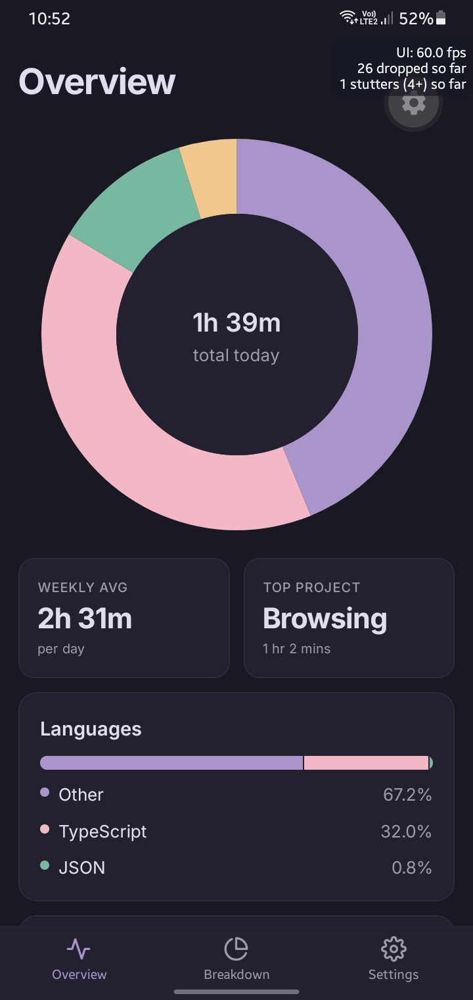

<p align="center">
  
  <h1 align="center">WakaDash</h1>
</p>

<p align="center">
  A React Native client for viewing WakaTime statistics on Android.
</p>

<p align="center">
  <a href="https://github.com/infinotiver/wakadash/releases/tag/v1.0.0">Install preview</a>
  ·
  <a href="https://github.com/infinotiver/wakadash/issues">Report Bug</a>
</p>

---

## Features

- View coding activity and time tracked by WakaTime (custom API support coming soon)
- Clean mobile-first interface
- Light and dark theme support
- User profile and account statistics
- Daily, weekly, monthly insights

## Screenshots



## Getting Started

### Prerequisites

- Node.js
- npm, pnpm, bun, or yarn
- Expo CLI (optional)

### Installation

```bash
git clone https://github.com/infinotiver/wakadash.git
cd wakadash
npm install
```

### Run

```bash
npm start
```

For specific platforms:

```bash
npm run android
npm run ios
npm run web
```

## Configuration

1. Generate a WakaTime API key from your WakaTime account settings.
2. Open WakaDash.
3. Enter your API key in the app.
4. Start exploring your coding statistics.

## Built With

- React Native
- Expo
- TypeScript
- React Query
- WakaTime API

## Roadmap

- [ ] Custom API support
- [ ] Offline caching
- [ ] Additional statistics views
- [ ] Shareable stat cards
- [ ] Widget support
- [ ] More customization options

## Contributing

Contributions, bug reports, and feature requests are welcome.

1. Fork the repository
2. Create a feature branch
3. Commit your changes
4. Open a pull request

## License

Distributed under the MIT License.
